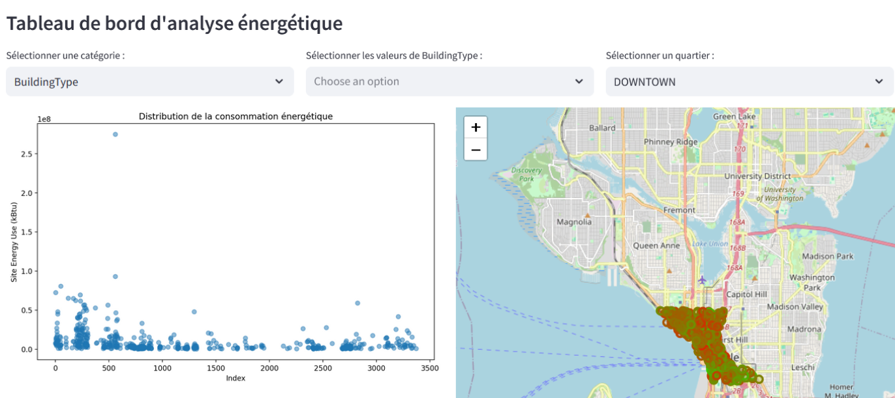
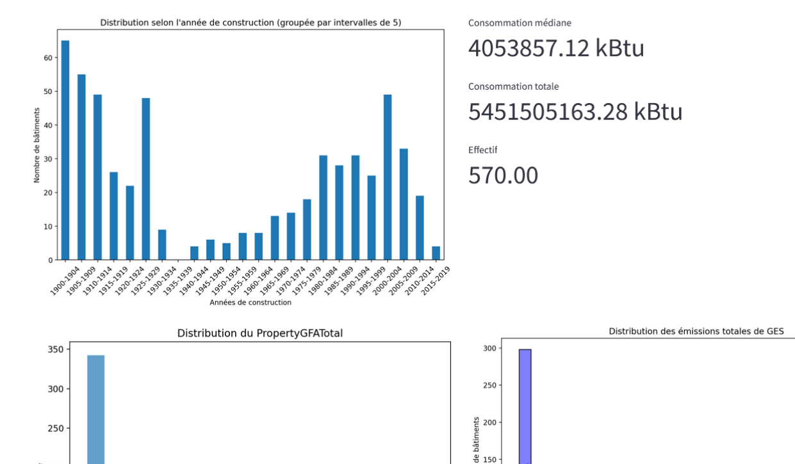
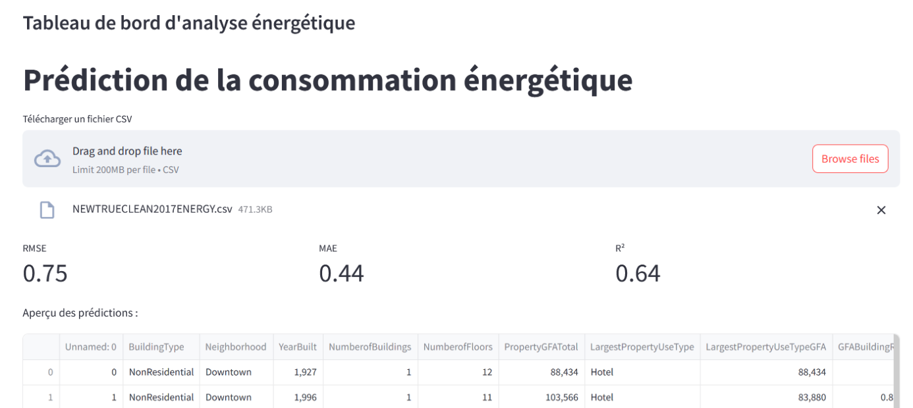

# Prédiction de Consommation d'Énergie à Seattle en Machine Learning





## Description du Projet

Ce projet vise à prédire  et à visualiser avec un dashboard la consommation d'énergie des bâtiments à Seattle en utilisant des données collectées en 2016. Les données comprennent des mesures annuelles de 3376 bâtiments sur 46 colonnes différentes. Nous avons développé un modèle basé sur XGBoost et effectué du feature engineering pour améliorer la précision des prédictions.

## Contenu du Répertoire

- `data/`: Répertoire contenant les données utilisées pour l'entraînement et les prédictions.
- `pages/`: Répertoire contenant le code source des pages de l'application Streamlit.
- `model/`: Répertoire contenant le modèle sous format joblib

  




## Fonctionnalités de l'Application Streamlit

Notre application Streamlit propose plusieurs fonctionnalités pour explorer et analyser les données de consommation d'énergie à Seattle :

- **Visualisations Géographiques :** Cartes interactives montrant la distribution spatiale de la consommation d'énergie.
- **Visualisations Graphiques :** Graphiques interactifs pour explorer les tendances de consommation d'énergie au fil du temps.
- **KPI (Key Performance Indicators) :** Indicateurs clés de performance pour évaluer le modèle.
- **Prédiction de Consommation d'Énergie :** Page dédiée à la prédiction de la consommation d'énergie basée sur le modèle XGBoost entraîné.


## Technologies Utilisées

- Python
- XGBoost
- Streamlit
- Pandas, NumPy, Matplotlib, Seaborn pour l'analyse et la visualisation des données




## Installation et Utilisation

Pour exécuter l'application Streamlit localement, suivez ces étapes :

1. Clonez ce repository :

   ```bash
   git clone https://github.com/ndaoalassane1634/prediction_energie.git
   cd nom_de_votre_projet
